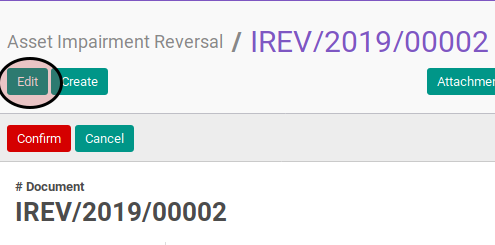
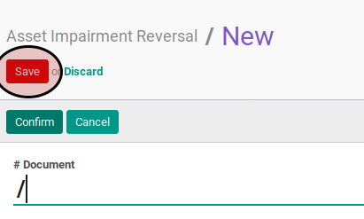

# Memodifikasi Asset Impairment Reversal

## A. INPUT

* Data asset impairment reversal yang dimodifikasi harus memiliki status **Draft**

## B. LANGKAH KERJA

1. Buka menu **Accounting -> Assets -> Impairment -> Impairment Reversal**. Abaikan jika sudah berada pada menu yang dimaksud.
2. Buka data asset impairment reversal yang akan dimodifikasi. Abaikan jika data sudah dibuka.
3. Klik tombol **Edit** pada bagian atas-kiri form.

4. Isi dan sesuaikan **# Document** jika dibutuhkan. Harus diisi.
5. Isi dan sesuaikan **Date** jika dibutuhkan. Harus diisi.
6. Pilih dan sesuaikan **Asset** jika dibutuhkan. Harus diisi.
7. Isi dan sesuaikan **Impairment Amount** jika dibutuhkan. Harus diisi.
8. Pilih dan sesuaikan **Impairment Account** jika dibutuhkan. Harus diisi.
9. Pilih dan sesuaikan **Contra-Impairment Account** jika dibutuhkan. Harus diisi.
10. Pilih dan sesuaikan **Journal** jika dibutuhkan. Harus diisi.
11. Buka tab **Note**.
12. Isi dan sesuaikan **Note** jika dibutuhkan. Harus diisi.
13. Klik tombol **Save** pada bagian atas-kiri form.

## C. OUTPUT

* Data asset impairment reversal akan berubah sesuai dengan perubahan yang dilakukan.
