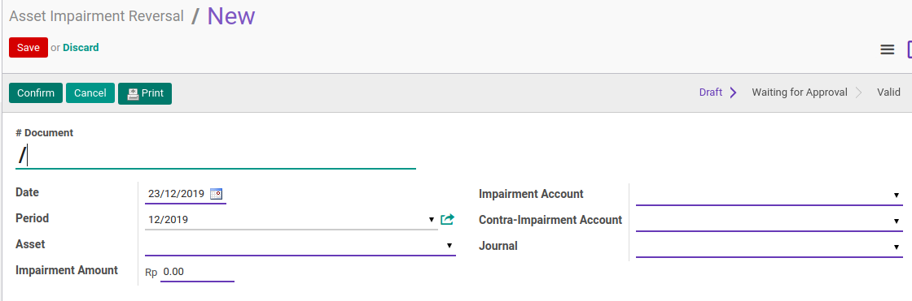
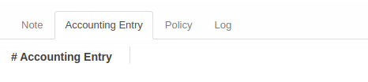
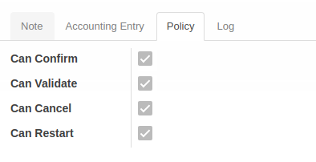
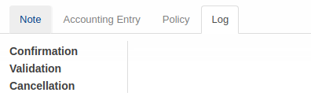

# Penjelasan Asset Impairment Reversal

Informasi pada **Asset Impairment Reversal** dibagi menjadi beberapa area, diantaranya:
* [Header](#bagian-header)
* [Tab Note](#tab-note)
* [Tab Accounting Entry](#tab-accounting)
* [Tab Policy](#tab-policy)
* [Tab Log](#tab-log)

### <a name="bagian-header">HEADER</a>

#### <a name="field-dokumen"># Dokumen</a>

Nomor Dokumen.

#### <a name="field-date">Date</a>

Tanggal Impairment Reversal.

#### <a name="field-period">Period</a>

Periode Impairment.
Biasanya sesuai dengan tanggal

#### <a name="field-aset">Aset</a>

Pilih Aset untuk proses Impairment Reversal.

#### <a name="field-impairment-amount">Impairment Amount</a>

Nilai Impairment Reversal (pemngembalian penurunan nilai).

#### <a name="field-impairment-account">Impairment Account</a>

Akun untuk impairment reversal.

#### <a name="field-contra-impairment-account">Contra Impairment Account</a>

Akun untuk contra impairment reversal.

#### <a name="field-journal">Journal</a>

Pilih Jurnal untuk impairment.

### <a name="tab-note">TAB NOTE</a>

#### <a name="field-note">Note</a>

Catatan tambahan.

### <a name="tab-accounting">TAB ACCOUNTING ENTRY</a>

#### <a name="field-accounting-entry"># Accounting Entry</a>

Nomor Accounting Entry.

### <a name="tab-policy">TAB POLICY</a>

#### <a name="field-change-can-confirm">Can Confirm</a>

Diisi otomatis oleh Odoo. Jika aktif, maka user yang membuka data dapat melakukan [mengkonfirmasi impairment reversal ](./mengkonfirmasi.md).

#### <a name="field-change-can-validate">Can Validate</a>

Disii otomatis oleh Odoo. Jika aktif, maka user yang membuka data dapat [memvalidasi impairment reversal](./memvalidasi.md).

#### <a name="field-change-can-cancel">Can Cancel</a>

Diisi otomatis oleh Odoo. Jika aktif, maka user yang membuka data dapat [membatalkan impairment reversal](./membatalkan.md).

#### <a name="field-change-can-restart">Can Restart</a>

Diisi otomatis oleh Odoo. Jika aktif, maka user yang membuka data dapat [merestart impairment reversal](./merestart.md).

### <a name="tab-log">TAB LOG</a>

#### <a name="field-log-confirmation">Confirmation</a>

Diisi otomatis oleh Odoo. Tanggal, waktu dan user yang [mengkonfirmasi impairment reversal](./mengkonfirmasi.md).

#### <a name="field-log-validation">Validation</a>

Diisi otomatis oleh Odoo. Tanggal, waktu, dan user yang [memvalidasi impairment reversal](./memvalidasi.md).

#### <a name="field-log-cancellation">Cancellation</a>

Diisi otomatis oleh Odoo. Tanggal, waktu, dan user yang [membatalkan impairment reversal](./membatalkan.md).

[**Kembali ke menu Asset Impairment**](./../asset-impairment-reversal.md)
