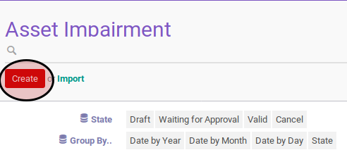
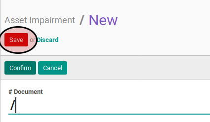

# Membuat Asset Impairment

## A. INPUT

*(Tidak ada instruksi khusus)*

## B. LANGKAH KERJA

1. Buka menu **Accounting -> Assets -> Impairment -> Impairment**. Abaikan jika sudah berada pada menu yang dimaksud.
2. Klik tombol **Create** pada bagian atas-kiri form.

3. Isi dan sesuaikan **# Document** jika dibutuhkan. Harus diisi.
4. Isi **Date**. Harus diisi.
5. Pilih **Asset**. Harus diisi.
6. Isi **Impairment Amount**. Harus diisi.
7. Pilih dan sesuaikan **Impairment Account** jika dibutuhkan. Harus diisi.
8. Pilih dan sesuaikan **Contra-Impairment Account** jika dibutuhkan. Harus diisi.
9. Pilih dan sesuaikan **Journal** jika dibutuhkan. Harus diisi.
10. Buka tab **Note**.
11. Isi **Note**. Harus diisi.
12. Klik tombol **Save** pada bagian atas-kiri form.

## C. OUTPUT

* Data complex asset impairment akan terbuat dengan status **Draft**.

## D. KEMBALI KE MENU SEBELUMNYA

[**Kembali ke menu Asset Impairment**](./../asset-impairment.md)
