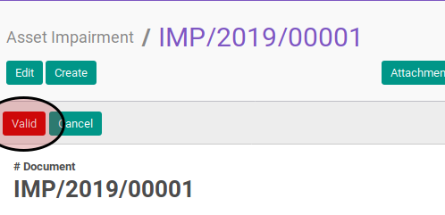

# Memvalidasi Asset Impairment

## A. INPUT

* Data asset impairment yang divalidasi harus memiliki status **Waiting for Approval**

* User yang akan memvalidasi harus memiliki akses untuk memvalidasi asset impairment.

## B. LANGKAH KERJA

1. Buka menu **Accounting -> Assets -> Impairment -> Impairment**. Abaikan jika sudah berada pada menu yang dimaksud.
2. Buka data asset impairment yang akan divalidasi. Abaikan jika data sudah dibuka.
3. Klik tombol **Valid** pada bagian atas-kiri form.

## C. OUTPUT

* Status asset impairment akan berubah menjadi **Valid**.

## D. KEMBALI KE MENU SEBELUMNYA

[**Kembali ke menu Asset Impairment**](./../asset-impairment.md)
