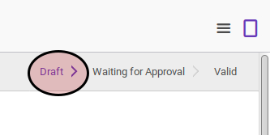

# Mengkonfirmasi Asset Impairment

## A. INPUT

* Data asset impairment yang dikonfirmasi harus memiliki status **Draft**

* User yang akan mengkonfirmasi harus memiliki akses untuk mengkonfirmasi asset impairment.

## B. LANGKAH KERJA

1. Buka menu **Accounting -> Assets -> Impairment -> Impairment**. Abaikan jika sudah berada pada menu yang dimaksud.
2. Buka data asset impairment yang akan dikonfirmasi. Abaikan jika data sudah dibuka.
3. Klik tombol **Confirm** pada bagian atas-kiri form.

## C. OUTPUT

* Status asset impairment akan berubah menjadi **Waiting for Approval**.

## D. KEMBALI KE MENU SEBELUMNYA

[**Kembali ke menu Asset Impairment**](./../asset-impairment.md)
