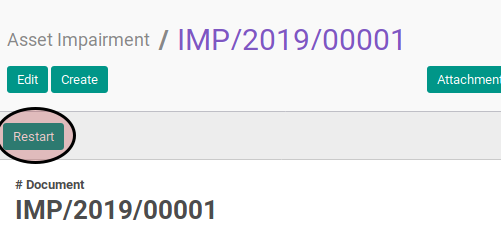

# Merestart Asset Impairment

## A. INPUT

* Data asset impairment yang direstart harus memiliki status **Cancel**

* User yang akan merestart harus memiliki akses untuk merestart asset impairment.

## B. LANGKAH KERJA

1. Buka menu **Accounting -> Assets -> Impairment -> Impairment**. Abaikan jika sudah berada pada menu yang dimaksud.
2. Buka data asset impairment yang akan direstart. Abaikan jika data sudah dibuka.
3. Klik tombol **Restart** pada bagian atas-kiri form.

## C. OUTPUT

* Status asset impairment akan berubah menjadi **Draft**.

