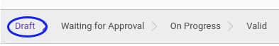

# Membuat Asset Improvement

## A. INPUT

*(Tidak ada instruksi khusus)*

## B. LANGKAH KERJA

1. Buka menu **Accounting -> Assets -> Improvement**. Abaikan jika sudah berada pada menu yang dimaksud.
2. Klik tombol **Create** pada bagian atas-kiri form.

3. Isi dan sesuaikan **[# Document](./penjelasan.md#field-dokumen)** jika dibutuhkan. Harus diisi.
4. Isi **[Improvement Date](./penjelasan.md#field-date)**. Harus diisi.
5. Isi **[Period](./penjelasan.md#field-period)**. Biasanya menyesuaikan tanggal improvement. Harus diisi.
6. Pilih **[Asset](./penjelasan.md#field-aset)**. Harus diisi.
7. Pilih **[Currency](./penjelasan.md#field-currency)**. Harus diisi.
8. Isi **[Improvement Amount](./penjelasan.md#field-improvement-amount)**. Harus diisi.
9. Nilai **[Asset Value History](./penjelasan.md#field-asset-value-history)** akan terisi otomatis sesuai transaksi.
10. Nilai **[Depreciation History](./penjelasan.md#field-depreciation-value-history)** akan terisi otomatis sesuai transaksi.
11. Buka tab **[Accounting Configuration](./penjelasan.md#tab-accounting-configuration)**
12. Pilih **[Account Move Creation](./penjelasan.md#field-account-move-creation)**. Harus diisi.
13. Pilih **[Exchange Account](./penjelasan.md#field-exchange-account)**. Harus diisi.
14. Pilih **[Accumulated Depreciation Account](./penjelasan.md#field-accumalted-depreciatiob-account)**. Harus diisi.
15. Pilih **[Journal](./penjelasan.md#field-journal)**. Harus diisi.
16. Buka tab **[Accounting Entry](./penjelasan.md#tab-accounting-entry)**
17. Nilai **[Account Move](./penjelasan.md#field-account-move)** akan terisi otomoatis sesuai transaksi.
18. Buka tab **[Note](./penjelasan.md#tab-note)**.
19. Isi **[Note](./penjelasan.md#field-note)**. Tidak Harus diisi.
20. Klik tombol **Save** pada bagian atas-kiri form.

## C. OUTPUT

* Data complex asset improvement akan terbuat dengan status **Draft**.

## D. KEMBALI KE MENU SEBELUMNYA

[**Kembali ke menu Asset improvement**](./../asset-improvement.md)
