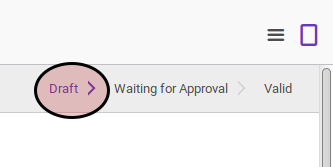
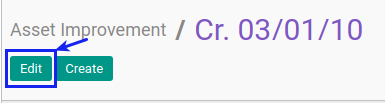
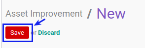

# Memodifikasi Asset Improvement

## A. INPUT

* Data asset impairment yang dimodifikasi harus memiliki status **Draft**

## B. LANGKAH KERJA

1. Buka menu **Accounting -> Assets -> Improvement**. Abaikan jika sudah berada pada menu yang dimaksud.
2. Buka data asset improvement yang akan dimodifikasi. Abaikan jika data sudah dibuka.
3. Klik tombol **Edit** pada bagian atas-kiri form.

4. Isi dan sesuaikan **[# Document](./penjelasan.md#field-dokumen)** jika dibutuhkan. Harus diisi.
5. Isi dan sesuaikan dan sesuaikan dan sesuaikan **[Improvement Date](./penjelasan.md#field-date)** jika dibutuhkan. Harus diisi.
6. Isi dan sesuaikan dan sesuaikan **[Period](./penjelasan.md#field-period)** jika dibutuhkan. Biasanya menyesuaikan tanggal improvement. Harus diisi.
7. Pilih dan sesuaikan **[Asset](./penjelasan.md#field-aset)** jika dibutuhkan. Harus diisi.
8. Pilih dan sesuaikan **[Currency](./penjelasan.md#field-currency)** jika dibutuhkan. Harus diisi.
9. Isi dan sesuaikan **[Improvement Amount](./penjelasan.md#field-improvement-amount)** jika dibutuhkan. Harus diisi.
10. Nilai **[Asset Value History](./penjelasan.md#field-asset-value-history)** akan terisi otomatis sesuai transaksi.
11. Nilai **[Depreciation History](./penjelasan.md#field-depreciation-value-history)** akan terisi otomatis sesuai transaksi.
12. Buka tab **[Accounting Configuration](./penjelasan.md#tab-accounting-configuration)**
13. Pilih dan sesuaikan **[Account Move Creation](./penjelasan.md#field-account-move-creation)** jika dibutuhkan. Harus diisi.
14. Pilih dan sesuaikan dan sesuaikan **[Exchange Account](./penjelasan.md#field-exchange-account)** jika dibutuhkan. Harus diisi.
15. Pilih dan sesuaikan **[Accumulated Depreciation Account](./penjelasan.md#field-accumalted-depreciatiob-account)**. Harus diisi.
16. Pilih dan sesuaikan **[Journal](./penjelasan.md#field-journal)** jika dibutuhkan. Harus diisi.
17. Buka tab **[Accounting Entry](./penjelasan.md#tab-accounting-entry)**
18. Nilai **[Account Move](./penjelasan.md#field-account-move)** akan terisi otomoatis sesuai transaksi.
19. Buka tab **[Note](./penjelasan.md#tab-note)**.
20. Isi dan sesuaikan **[Note](./penjelasan.md#field-note)** jika dibutuhkan. Tidak Harus diisi.
21. Klik tombol **Save** pada bagian atas-kiri form.

## C. OUTPUT

* Data asset improvement akan berubah sesuai dengan perubahan yang dilakukan.

## D. KEMBALI KE MENU SEBELUMNYA

[**Kembali ke menu Asset Improvement**](./../asset-improvement.md)
