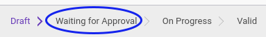

# Menyetujui Asset Improvement

## A. INPUT

* Data asset improvement yang divalidasi harus memiliki status **Waiting for Approval**

* User yang akan memvalidasi harus memiliki akses untuk memvalidasi asset improvement.

## B. LANGKAH KERJA

1. Buka menu **Accounting -> Assets -> Impairment -> Improvement**. Abaikan jika sudah berada pada menu yang dimaksud.
2. Buka data asset improvement yang akan divalidasi. Abaikan jika data sudah dibuka.
3. Klik tombol **Approved** pada bagian atas-kiri form.

## C. OUTPUT

* Status asset improvement akan berubah menjadi **On Progress**.

## D. KEMBALI KE MENU SEBELUMNYA

[**Kembali ke menu Asset Improvement**](./../asset-improvement.md)
