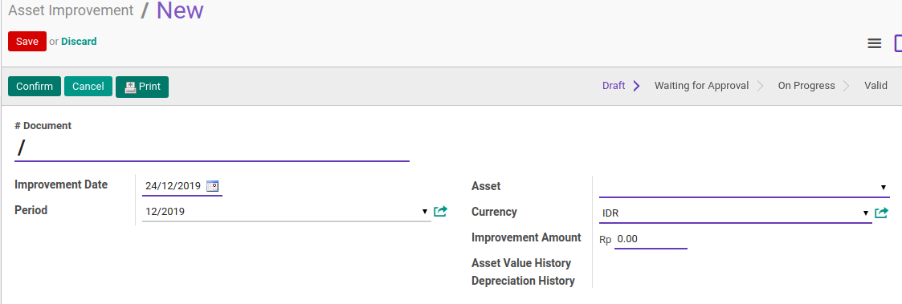
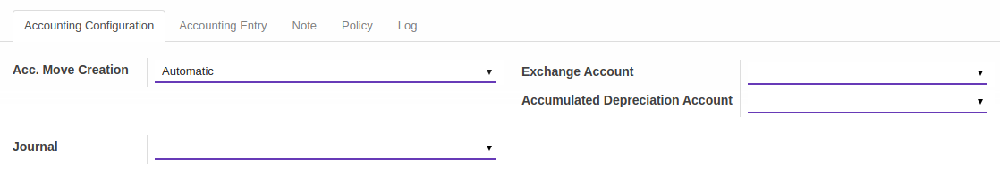
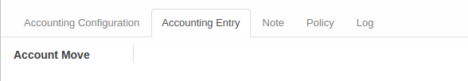
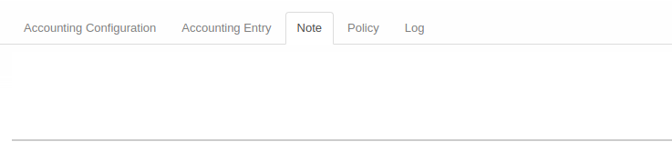
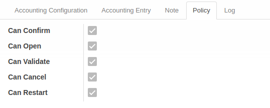
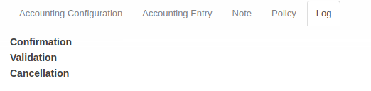

# Penjelasan Asset Improvement

Informasi pada **Asset Improvement** dibagi menjadi beberapa area, diantaranya:
* [Header](#bagian-header)
* [Tab Accounting Configuration](#tab-accounting-configuration)
* [Tab Accounting Entry](#tab-accounting-entry)
* [Tab Note](#tab-note)
* [Tab Policy](#tab-policy)
* [Tab Log](#tab-log)

### <a name="bagian-header">HEADER</a>

#### <a name="field-dokumen"># Document</a>

Nomor Dokumen.
(Nomor akan terisi otomatis setelah dikonfirmasi)

#### <a name="field-date">Date</a>

Tanggal Improvement.

#### <a name="field-period">Period</a>

Periode Impairment.
Biasanya sesuai dengan tanggal

#### <a name="field-aset">Aset</a>

Pilih Aset yang akan diimpairment.

#### <a name="field-currency">Curreny</a>

Mata Uang (Currency).

#### <a name="field-improvement-amount">Improvement Amount</a>

Nilai Improvement

#### <a name="field-asset-value-history">Asset Value History</a>

History nilai asset

#### <a name="field-depreciation-value-history">Depreciation Value History</a>

History nilai penyusutan (depreciation)

### <a name="tab-accounting-configuration">TAB ACCOUNTING CONFIGURATION</a>

#### <a name="field-account-move-creation">Account Move Creation</a>

Jenis Account Move Creation.

#### <a name="field-exchange-account">Exchange Account</a>

Akun Exhange.

#### <a name="field-accumulated-depreciation-account">Accumulated Depreciation Account</a>

Akun Akumulasi Penyusutan (Accumulated Depreciation).

#### <a name="field-journal">Journal</a>

Jurnal.

### <a name="tab-accounting-entry">TAB ACCOUNTING ENTRY</a>

#### <a name="field-account-move"># Account Move</a>

Nomor Account Move.

### <a name="tab-note">TAB NOTE</a>

#### <a name="field-note">Note</a>

Catatan tambahan.

### <a name="tab-policy">TAB POLICY</a>

#### <a name="field-change-can-confirm">Can Confirm</a>

Diisi otomatis oleh Odoo. Jika aktif, maka user yang membuka data dapat melakukan [mengkonfirmasi proses improvement](./mengkonfirmasi.md).

#### <a name="field-change-can-open">Can Open</a>

Diisi otomatis oleh Odoo. Jika aktif, maka user yang membuka data transisi dapat melakukan [proses menyetujui transisi](./menyetujui.md).
#TODO

#### <a name="field-change-can-validate">Can Validate</a>

Disii otomatis oleh Odoo. Jika aktif, maka user yang membuka data dapat [memvalidasi proses improvement](./memvalidasi.md).

#### <a name="field-change-can-cancel">Can Cancel</a>

Diisi otomatis oleh Odoo. Jika aktif, maka user yang membuka data dapat [membatalkan proses improvement](./membatalkan.md).

#### <a name="field-change-can-restart">Can Restart</a>

Diisi otomatis oleh Odoo. Jika aktif, maka user yang membuka data dapat [merestart proses improvement](./merestart.md).

### <a name="tab-log">TAB LOG</a>

#### <a name="field-log-confirmation">Confirmation</a>

Diisi otomatis oleh Odoo. Tanggal, waktu dan user yang [mengkonfirmasi proses improvement](./mengkonfirmasi.md).

#### <a name="field-log-validation">Validation</a>

Diisi otomatis oleh Odoo. Tanggal, waktu, dan user yang [memvalidasi proses improvement](./memvalidasi.md).

#### <a name="field-log-cancellation">Cancellation</a>

Diisi otomatis oleh Odoo. Tanggal, waktu, dan user yang [membatalkan proses improvement](./membatalkan.md).

[**Kembali ke menu Asset Improvement**](./../asset-improvement.md)
