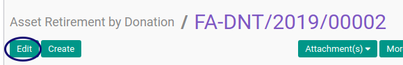

# Memodifikasi Asset Retirement By Donation

## A. INPUT

* Data Asset Retirement By Donation yang dimodifikasi harus memiliki status **Draft**

## B. LANGKAH KERJA

1. Buka menu **Accounting -> Assets -> Retirement -> Retirement By Donation**. Abaikan jika sudah berada pada menu yang dimaksud.
2. Buka data Asset Retirement By Donation yang akan dimodifikasi. Abaikan jika data sudah dibuka.
3. Klik tombol **Edit** pada bagian atas-kiri form.

4. Isi dan sesuaikan **[# Document](./penjelasan.md#field-document)** jika dibutuhkan. Harus diisi.
5. Isi dan sesuaikan **[Disposition Date](./penjelasan.md#field-date)** jika dibutuhkan. Harus diisi.
6. Pilih dan sesuaikan **[Period](./penjelasan.md#field-period)** jika dibutuhkan. Harus diisi.
7. Pilih dan sesuaikan **[Asset](./penjelasan.md#field-asset)** jika dibutuhkan. Harus diisi.
8. Pilih dan sesuaikan **[Currency](./penjelasan.md#field-currency)** jika dibutuhkan. Harus diisi.
9. Isi dan sesuaikan **[Disposition Price](./penjelasan.md#field-disposition-price)** jika dibutuhkan. Harus Diisi.
10. Nilai **[Acquisition Price](./penjelasan.md#field-acquisition-price)**. Akan terisi otomatis..
11. Nilai **[Depreciated Value](./penjelasan.md#field-depreciated-value)** akan terisi otomatis sesuai transaksi.
12. Nilai **[Gain/Loss Amount](./penjelasan.md#field-gain-loss-amount)** akan terisi otomatis sesuai transaksi.
13. Buka tab **[Accounting Configuration](./penjelasan.md#tab-accounting-configuration)**.
14. Pilih dan sesuaikan **[Exchange Acc. Move Creation](./penjelasan.md#field-exchange-acc-move-creation)** jika dibutuhkan. Harus diisi.
15. Pilih dan sesuaikan **[Disposal Acc. Move Creation](./penjelasan.md#field-disposal-acc-move-creation)** jika dibutuhkan. Harus diisi.
16. Pilih dan sesuaikan **[Gain/Loss Acc. Move](./penjelasan.md#field-gain-loss-acc-move-creation)** jika dibutuhkan. Harus diisi.
17. Pilih dan sesuaikan **[Asset Account](./penjelasan.md#field-asset-account)** jika dibutuhkan. Harus diisi.
18. Pilih dan sesuaikan **[Exchange Account](./penjelasan.md#field-exchange-account)** jika dibutuhkan. Harus diisi.
19. Pilih dan sesuaikan **[Accumulated Depreciation Account](./penjelasan.md#field-accumulated-depreciation-account)** jika dibutuhkan. Harus diisi.
20. Pilih dan sesuaikan **[Gain Account](./penjelasan.md#field-gain-account)** jika dibutuhkan. Harus diisi.
21. Pilih dan sesuaikan **[Loss Account](./penjelasan.md#field-loss-account)** jika dibutuhkan. Harus diisi.
22. Pilih dan sesuaikan **[Exchange Journal](./penjelasan.md#field-exchange-journal)** jika dibutuhkan. Harus diisi.
23. Pilih dan sesuaikan **[Disposal Journal](./penjelasan.md#field-disposal-journal)** jika dibutuhkan. Harus diisi.
24. Pilih dan sesuaikan **[Gain Journal](./penjelasan.md#field-gain-journal)** jika dibutuhkan. Harus diisi.
25. Buka tab **[Accounting Entry](./penjelasan.md#tab-tab-accounting-entry)**.
26. Nilai **[Exchange Account Move](./penjelasan.md#field-exchange-acc-move)** akan terisi otomatis sesuai transaksi.
27. Nilai **[Disposal Account Move](./penjelasan.md#field-disposal-acc-move)** akan terisi otomatis sesuai transaksi.
28. Nilai **[Gain/Loss Account Move](./penjelasan.md#field-gain-loss-acc-move)** akan terisi otomatis sesuai transaksi.
29. Buka tab **[Note](./penjelasan.md#tab-note)**.
30. Isi dan sesuaikan **[Note](./penjelasan.md#field-note)** jika dibutuhkan. Tidak Harus diisi.
31. Klik tombol **Save** pada bagian atas-kiri form.

## C. OUTPUT

* Data Asset Retirement By Donation akan berubah sesuai dengan perubahan yang dilakukan.

## D. KEMBALI KE MENU SEBELUMNYA

[**Kembali ke menu Asset Retirement By Donation**](./../asset-retirement-donation.md)
