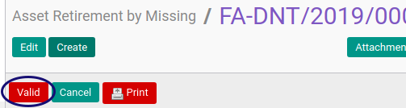

# Memvalidasi Asset Retirement By Missing

## A. INPUT

* Data Asset Retirement By Missing yang divalidasi harus memiliki status **On Progress**

* User yang akan memvalidasi harus memiliki akses untuk memvalidasi Asset Retirement By Missing.

## B. LANGKAH KERJA

1. Buka menu **Accounting -> Assets -> Retirement -> Retirement By Missing**. Abaikan jika sudah berada pada menu yang dimaksud.
2. Buka data Asset Retirement By Missing yang akan divalidasi. Abaikan jika data sudah dibuka.
3. Klik tombol **Valid** pada bagian atas-kiri form.

## C. OUTPUT

* Status Asset Retirement By Missing akan berubah menjadi **Valid**.

## D. KEMBALI KE MENU SEBELUMNYA

[**Kembali ke menu Asset Retirement By Missing**](./../asset-retirement-missing.md)
