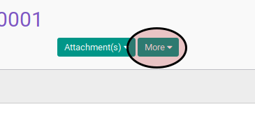

# Menghapus Asset Retirement By Sale

## A. INPUT

* Data Asset Retirement By Sale yang dihapus harus memiliki status **Draft**

## B. LANGKAH KERJA

1. Buka menu **Accounting -> Assets -> Retirement -> Retirement By Sale**. Abaikan jika sudah berada pada menu yang dimaksud.
2. Buka data Asset Retirement By Sale yang akan dihapus. Abaikan jika data sudah dibuka.
3. Klik tombol **More** pada bagian atas-kiri form.

4. Klik tombol **Delete** pada drop-down yang muncul pada tombol **More**.

5. Klik tombol **Ok** pada dialog konfirmasi penghapusan yang muncul.

## C. OUTPUT

* Data Asset Retirement By Sale akan terhapus.

## D. KEMBALI KE MENU SEBELUMNYA

[**Kembali ke menu Asset Retirement By Sale**](./../asset-retirement-sale.md)
