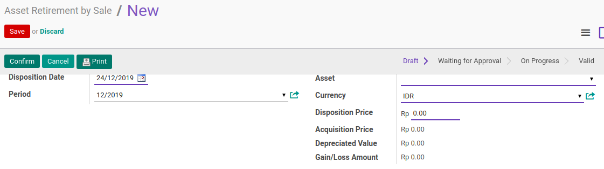
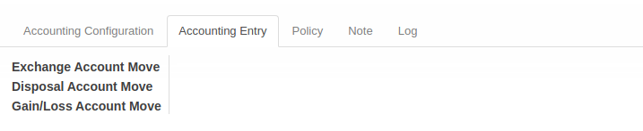

# Penjelasan Asset Retirement By Sale

Informasi pada **Asset Retirement Sale** dibagi menjadi beberapa area, diantaranya:
* [Header](#bagian-header)
* [Tab Accounting Configuration](#tab-accounting-configuration)
* [Tab Accounting Entry](#tab-accounting-entry)
* [Tab Policy](#tab-policy)
* [Tab Note](#tab-note)
* [Tab Log](#tab-log)

### <a name="bagian-header">HEADER</a>

#### <a name="field-document"># Document</a>

Nomor Dokumen.

#### <a name="field-disposition-date">Disposition Date</a>

Tanggal Disposisi.

#### <a name="field-period">Period</a>

Periode tranasaksi

#### <a name="field-asset">Asset</a>

Fix Aset.

#### <a name="field-currency">Currency</a>

Currency/Mata Uang.

#### <a name="field-disposition-price">Disposition Price</a>

Harga Disposisi

#### <a name="field-acquisition-price">Acquisition Price</a>

Harga Perolehan

#### <a name="field-depreciated-value">Depreciated Value</a>

Nilai Penyusutan

#### <a name="field-gain-loss-amount">Gain/Loss Amount</a>

Jumalah Keuntungan/Kerugian

### <a name="tab-accounting-configuration">TAB ACCOUNTING CONFIGURATION</a>

#### <a name="field-exchange-acc-move-creation">Exchange Acc. Move Creation</a>

Exchange Acc. Move Creation #TODO

#### <a name="field-disposal-acc-move-creation">Disposal Acc. Move Creation</a>

Disposal Acc. Move Creation #TODO

#### <a name="field-gain-loss-acc-move-creation">Gain/Loss Acc. Move Creation</a>

Gain/Loss Acc. Move Creation #TODO

#### <a name="field-asset-account">Asset Account</a>

Akun Aset

#### <a name="field-exchange-account">Exchange Account</a>

Akun Kebalikan (Exchange Account)

#### <a name="field-accumulated-depreciation-account">Accumulated Depreciation Account</a>

Akun Akumulasi Penyusutan (Accumulated Depreciation Account)

#### <a name="field-gain-account">Gain Account</a>

Akun Keuntungan/Laba (Gain Account)

#### <a name="field-loss-account">Loss Account</a>

Akun Kerugian/Rugi (Loss Account)

#### <a name="field-exchange-journal">Exchange Journal</a>

Jurnal Kebalikan (Exchange Journal)

#### <a name="field-disposal-journal">Disposal Journal</a>

Jurnal Penyelesain (Disposal Journal)

#### <a name="field-gain-journal">Gain Journal</a>

Jurnal Keuntungan/Laba (Gain Journal)

### <a name="tab-accounting-entry">TAB ACCOUNTING ENTRY</a>

#### <a name="field-exchange-acc-move">Exchange Account Move</a>

Exchange Account Move #TODO

#### <a name="field-disposal-acc-move">Disposal Account Move</a>

Disposal Account Move#TODO

#### <a name="field-gain-loss-acc-move">Gain/Loss Account Move</a>

Gain/Loss Account Move#TODO

### <a name="tab-note">TAB NOTE</a>

### <a name="tab-policy">TAB POLICY</a>

#### <a name="field-change-can-confirm">Can Confirm</a>

Diisi otomatis oleh Odoo. Jika aktif, maka user yang membuka data transisi dapat melakukan [mengkonfirmasi transisi](./mengkonfirmasi.md).

#### <a name="field-change-can-open">Can Open</a>

Diisi otomatis oleh Odoo. Jika aktif, maka user yang membuka data transisi dapat melakukan [proses menyetujui transisi](./menyetujui.md).
#TODO

#### <a name="field-change-can-validate">Can Validate</a>

Disii otomatis oleh Odoo. Jika aktif, maka user yang membuka data dapat [memvalidasi transisi](./memvalidasi.md).

#### <a name="field-change-can-cancel">Can Cancel</a>

Diisi otomatis oleh Odoo. Jika aktif, maka user yang membuka data dapat [membatalkan transisi](./membatalkan.md).

#### <a name="field-change-can-restart">Can Restart</a>

Diisi otomatis oleh Odoo. Jika aktif, maka user yang membuka data dapat [merestart transisi](./merestart.md).

#### <a name="field-note">Note</a>

Catatan tambahan.

### <a name="tab-log">TAB LOG</a>

#### <a name="field-log-confirmation">Confirmation</a>

Diisi otomatis oleh Odoo. Tanggal, waktu dan user yang [mengkonfirmasi transisi](./mengkonfirmasi.md).

#### <a name="field-log-validation">Validation</a>

Diisi otomatis oleh Odoo. Tanggal, waktu, dan user yang [memvalidasi transisi](./memvalidasi.md).

#### <a name="field-log-cancellation">Cancellation</a>

Diisi otomatis oleh Odoo. Tanggal, waktu, dan user yang [membatalkan transisi](./membatalkan.md).

[**Kembali ke menu Asset Retirement Sale**](./../asset-retirement-sale.md)
