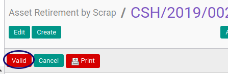

# Memvalidasi Asset Retirement By Scrap

## A. INPUT

* Data Asset Retirement By Scrap yang divalidasi harus memiliki status **On Progress**

* User yang akan memvalidasi harus memiliki akses untuk memvalidasi Asset Retirement By Scrap.

## B. LANGKAH KERJA

1. Buka menu **Accounting -> Assets -> Retirement -> Retirement By Scrap**. Abaikan jika sudah berada pada menu yang dimaksud.
2. Buka data Asset Retirement By Scrap yang akan divalidasi. Abaikan jika data sudah dibuka.
3. Klik tombol **Valid** pada bagian atas-kiri form.

## C. OUTPUT

* Status Asset Retirement By Scrap akan berubah menjadi **Valid**.

## D. KEMBALI KE MENU SEBELUMNYA

[**Kembali ke menu Asset Retirement By Scrap**](./../asset-retirement-scrap.md)
