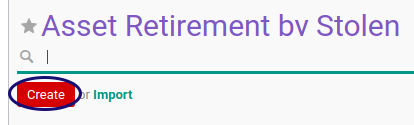

# Membuat Asset Retirement By Stolen

## A. INPUT

*(Tidak ada instruksi khusus)*

## B. LANGKAH KERJA

1. Buka menu **Accounting -> Assets -> Retirement -> Retirement By Stolen**. Abaikan jika sudah berada pada menu yang dimaksud.
2. Klik tombol **Create** pada bagian atas-kiri form.

3. Isi dan sesuaikan **[# Document](./penjelasan.md#field-document)** jika dibutuhkan. Harus diisi.
4. Isi **[Disposition Date](./penjelasan.md#field-date)**. Harus diisi.
5. Pilih **[Period](./penjelasan.md#field-period)**. Harus diisi. Biasanya sesuai dengan tanggal.
6. Pilih **[Asset](./penjelasan.md#field-asset)**. Harus diisi.
7. Pilih **[Currency](./penjelasan.md#field-currency)**. Harus diisi.
8. Isi **[Disposition Price](./penjelasan.md#field-disposition-price)**. Harus Diisi.
9. Nilai **[Acquisition Price](./penjelasan.md#field-acquisition-price)**. Akan terisi otomatis..
10. Nilai **[Depreciated Value](./penjelasan.md#field-depreciated-value)** akan terisi otomatis sesuai transaksi.
11. Nilai **[Gain/Loss Amount](./penjelasan.md#field-gain-loss-amount)** akan terisi otomatis sesuai transaksi.
12. Buka tab **[Accounting Configuration](./penjelasan.md#tab-accounting-configuration)**.
13. Pilih **[Exchange Acc. Move Creation](./penjelasan.md#field-exchange-acc-move-creation)**. Harus diisi.
14. Pilih **[Disposal Acc. Move Creation](./penjelasan.md#field-disposal-acc-move-creation)**. Harus diisi.
15. Pilih **[Gain/Loss Acc. Move](./penjelasan.md#field-gain-loss-acc-move-creation)**. Harus diisi.
16. Pilih **[Asset Account](./penjelasan.md#field-asset-account)**. Harus diisi.
17. Pilih **[Exchange Account](./penjelasan.md#field-exchange-account)**. Harus diisi.
18. Pilih **[Accumulated Depreciation Account](./penjelasan.md#field-accumulated-depreciation-account)**. Harus diisi.
19. Pilih **[Gain Account](./penjelasan.md#field-gain-account)**. Harus diisi.
20. Pilih **[Loss Account](./penjelasan.md#field-loss-account)**. Harus diisi.
21. Pilih **[Exchange Journal](./penjelasan.md#field-exchange-journal)**. Harus diisi.
22. Pilih **[Disposal Journal](./penjelasan.md#field-disposal-journal)**. Harus diisi.
23. Pilih **[Gain Journal](./penjelasan.md#field-gain-journal)**. Harus diisi.
24. Buka tab **[Accounting Entry](./penjelasan.md#tab-tab-accounting-entry)**.
25. Nilai **[Exchange Account Move](./penjelasan.md#field-exchange-acc-move)** akan terisi otomatis sesuai transaksi.
26. Nilai **[Disposal Account Move](./penjelasan.md#field-disposal-acc-move)** akan terisi otomatis sesuai transaksi.
27. Nilai **[Gain/Loss Account Move](./penjelasan.md#field-gain-loss-acc-move)** akan terisi otomatis sesuai transaksi.
28. Buka tab **[Note](./penjelasan.md#tab-note)**.
29. Isi **[Note](./penjelasan.md#field-note)**. Tidak Harus diisi.
30. Klik tombol **Save** pada bagian atas-kiri form.

## C. OUTPUT

* Data Asset Retirement By Stolen akan terbuat dengan status **Draft**.

## D. KEMBALI KE MENU SEBELUMNYA

[**Kembali ke menu Asset Retirement By Stolen**](./../asset-retirement-stolen.md)
