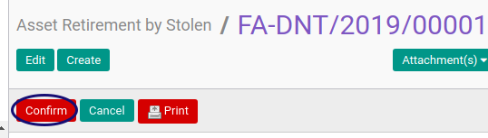

# Mengkonfirmasi Asset Retirement By Stolen

## A. INPUT

* Data Asset Retirement By Stolen yang dikonfirmasi harus memiliki status **Draft**

* User yang akan mengkonfirmasi harus memiliki akses untuk mengkonfirmasi Asset Retirement By Stolen.

## B. LANGKAH KERJA

1. Buka menu **Accounting -> Assets -> Retirement -> Retirement By Stolen**. Abaikan jika sudah berada pada menu yang dimaksud.
2. Buka data Asset Retirement By Stolen yang akan dikonfirmasi. Abaikan jika data sudah dibuka.
3. Klik tombol **Confirm** pada bagian atas-kiri form.

## C. OUTPUT

* Status Asset Retirement By Stolen akan berubah menjadi **Waiting for Approval**.

## D. KEMBALI KE MENU SEBELUMNYA

[**Kembali ke menu Asset Retirement By Stolen**](./../asset-retirement-stolen.md)
