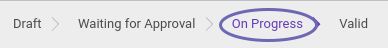

# Menyetujui Asset Retirement By Stolen

## A. INPUT

* Data Asset Retirement By Stolen yang disetujui harus memiliki status **Waiting for Approval**

* User yang akan menyetujui harus memiliki akses untuk menyetujui Asset Retirement By Donation.

## B. LANGKAH KERJA

1. Buka menu **Accounting -> Assets -> Retirement -> Retirement By Stolen**. Abaikan jika sudah berada pada menu yang dimaksud.
2. Buka Data Asset Retirement By Stolen yang akan disetujui. Abaikan jika data sudah dibuka.
3. Klik tombol **Approved** pada bagian atas-kiri form.

## C. OUTPUT

* Status Asset Retirement By Donation akan berubah menjadi **On Progress**.

## D. KEMBALI KE MENU SEBELUMNYA

[**Kembali ke menu Asset Retirement By Donation**](./../asset-retirement-stolen.md)
