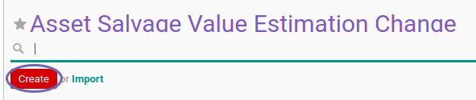

# Membuat Asset Salvage Value Estimation Change

## A. INPUT

*(Tidak ada instruksi khusus)*

## B. LANGKAH KERJA

1. Buka menu **Accounting -> Assets -> Estimation Change -> Salvage Value**. Abaikan jika sudah berada pada menu yang dimaksud.
2. Klik tombol **Create** pada bagian atas-kiri form.

3. Isi dan sesuaikan **[# Document](./penjelasan.md#field-document)** jika dibutuhkan. Harus diisi.
4. Isi **[Date](./penjelasan.md#field-date)**. Harus diisi.
5. Pilih **[Asset](./penjelasan.md#field-asset)**. Harus diisi.
6. Pilih **[Currency](./penjelasan.md#field-currency)**. Harus diisi.
7. Nilai **[Previous Salvage Value](./penjelasan.md#field-previous-salvage-value)** akan terisi otomatis.
8. Isi **[Salvage Value](./penjelasan.md#field-salvage-value)**. Harus diisi.
9. Nilai **[Asset Value History](./penjelasan.md#field-asset-value-history)** akan terisi otomatis sesuai transaksi.
10. Nilai **[Depreciation History](./penjelasan.md#field-depreciation-value-history)** akan terisi otomatis sesuai transaksi.
11. Buka tab **[Note](./penjelasan.md#tab-note)**.
12. Isi **[Note](./penjelasan.md#field-note)**. Tidak Harus diisi.
13. Klik tombol **Save** pada bagian atas-kiri form.

## C. OUTPUT

* Data Asset Salvage Value Estimation Change akan terbuat dengan status **Draft**.

## D. KEMBALI KE MENU SEBELUMNYA

[**Kembali ke menu Asset Salvage Value Estimation Change**](./../asset-salvage-value-estimation-change.md)
