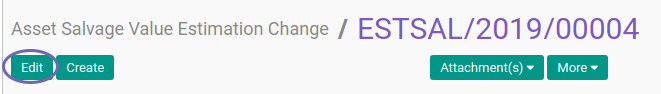
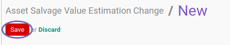

# Memodifikasi Asset Salvage Value Estimation Change

## A. INPUT

* Data Asset Salvage Value Estimation Change yang dimodifikasi harus memiliki status **Draft**

## B. LANGKAH KERJA

1. Buka menu **Accounting -> Assets -> Estimation Change -> Salvage Value**. Abaikan jika sudah berada pada menu yang dimaksud.
2. Buka data Asset Salvage Value Estimation Change yang akan dimodifikasi. Abaikan jika data sudah dibuka.
3. Klik tombol **Edit** pada bagian atas-kiri form.

4. Isi dan sesuaikan **[# Document](./penjelasan.md#field-document)** jika dibutuhkan. Harus diisi.
5. Isi dan sesuaikan **[Date](./penjelasan.md#field-date)** jika dibutuhkan. Harus diisi.
6. Pilih dan sesuaikan **[Asset](./penjelasan.md#field-asset)** jika dibutuhkan. Harus diisi.
7. Pilih dan sesuaikan **[Currency](./penjelasan.md#field-currency)** jika dibutuhkan. Harus diisi.
8. Nilai **[Previous Salvage Value](./penjelasan.md#field-previous-salvage-value)** akan terisi otomatis.
9. Isi dan sesuaikan **[Salvage Value](./penjelasan.md#field-salvage-value)** jika dibutuhkan. Harus diisi.
10. Nilai **[Asset Value History](./penjelasan.md#field-asset-value-history)** akan terisi otomatis sesuai transaksi.
11. Nilai **[Depreciation History](./penjelasan.md#field-depreciation-value-history)** akan terisi otomatis sesuai transaksi.
12. Buka tab **[Note](./penjelasan.md#tab-note)**.
13. Isi dan sesuaikan **[Note](./penjelasan.md#field-note)** jika dibutuhkan. Tidak Harus diisi.
14. Klik tombol **Save** pada bagian atas-kiri form.

## C. OUTPUT

* Data Asset Salvage Value Estimation Change akan berubah sesuai dengan perubahan yang dilakukan.

## D. KEMBALI KE MENU SEBELUMNYA

[**Kembali ke menu Asset Salvage Value Estimation Change**](./../asset-salvage-value-estimation-change.md)
