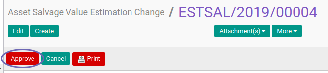

# Menyetujui Asset Salvage Value Estimation Change

## A. INPUT

* Data Asset Salvage Value Estimation Change yang disetujui harus memiliki status **Waiting for Approval**

* User yang akan menyetujui harus memiliki akses untuk menyetujui Asset Salvage Value Estimation Change.

## B. LANGKAH KERJA

1. Buka menu **Accounting -> Assets -> Estimation Change -> Salvage Value**. Abaikan jika sudah berada pada menu yang dimaksud.
2. Buka data Asset Salvage Value Estimation Change yang akan disetujui. Abaikan jika data sudah dibuka.
3. Klik tombol **Approved** pada bagian atas-kiri form.

## C. OUTPUT

* Status Asset Salvage Value Estimation Change akan berubah menjadi **On Progress**.

## D. KEMBALI KE MENU SEBELUMNYA

[**Kembali ke menu Asset Salvage Value Estimation Change**](./../asset-salvage-value-estimation-change.md)
