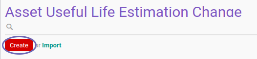
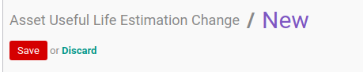

# Membuat Asset Useful Life Estimation Change

## A. INPUT

*(Tidak ada instruksi khusus)*

## B. LANGKAH KERJA

1. Buka menu **Accounting -> Assets -> Estimation Change -> Useful of Life**. Abaikan jika sudah berada pada menu yang dimaksud.
2. Klik tombol **Create** pada bagian atas-kiri form.

3. Isi dan sesuaikan **[# Document](./penjelasan.md#field-document)** jika dibutuhkan. Harus diisi.
4. Isi **[Date](./penjelasan.md#field-date)**. Harus diisi.
5. Pilih **[Asset](./penjelasan.md#field-asset)**. Harus diisi.
6. Nilai **[Previous Number of Years](./penjelasan.md#field-previous-number-of-years)** akan terisi otomatis.
7. Nilai **[Previous Period Length](./penjelasan.md#field-previous-periode-length)** akan terisi otomatis.
8. Isi **[Number of Years](./penjelasan.md#field-number-of-years)**. Harus diisi.
9. Pilih **[Period Length](./penjelasan.md#field-periode-length)**. Harus diisi.
10. Nilai **[Asset Value History](./penjelasan.md#field-asset-value-history)** akan terisi otomatis sesuai transaksi.
11. Nilai **[Depreciation History](./penjelasan.md#field-depreciation-value-history)** akan terisi otomatis sesuai transaksi.
12. Buka tab **[Note](./penjelasan.md#tab-note)**.
13. Isi **[Note](./penjelasan.md#field-note)**. Tidak Harus diisi.
14. Klik tombol **Save** pada bagian atas-kiri form.

## C. OUTPUT

* Data Asset Useful Life Estimation Change akan terbuat dengan status **Draft**.

## D. KEMBALI KE MENU SEBELUMNYA

[**Kembali ke menu Asset Useful Life Estimation Change**](./../asset-useful-life-estimation-change.md)
