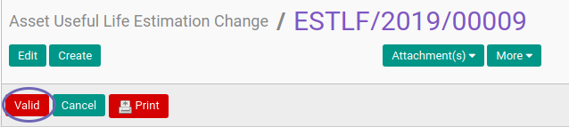

# Memvalidasi Asset Useful Life Estimation Change

## A. INPUT

* Data Asset Useful Life Estimation Change yang divalidasi harus memiliki status **On Progress**

* User yang akan memvalidasi harus memiliki akses untuk memvalidasi Asset Useful Life Estimation Change.

## B. LANGKAH KERJA

1. Buka menu **Accounting -> Assets -> Estimation Change -> Useful of Life**. Abaikan jika sudah berada pada menu yang dimaksud.
2. Buka data Asset Useful Life Estimation Change yang akan divalidasi. Abaikan jika data sudah dibuka.
3. Klik tombol **Valid** pada bagian atas-kiri form.

## C. OUTPUT

* Status Asset Useful Life Estimation Change akan berubah menjadi **Valid**.

## D. KEMBALI KE MENU SEBELUMNYA

[**Kembali ke menu Asset Useful Life Estimation Change**](./../asset-useful-life-estimation-change.md)
