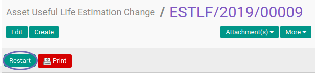

# Merestart Asset Useful Life Estimation Change

## A. INPUT

* Data Asset Useful Life Estimation Change yang direstart harus memiliki status **Cancel**

* User yang akan merestart harus memiliki akses untuk merestart Asset Useful Life Estimation Change.

## B. LANGKAH KERJA

1. Buka menu **Accounting -> Assets -> Estimation Change -> Useful of Life**. Abaikan jika sudah berada pada menu yang dimaksud.
2. Buka data Asset Useful Life Estimation Change yang akan direstart. Abaikan jika data sudah dibuka.
3. Klik tombol **Restart** pada bagian atas-kiri form.

## C. OUTPUT

* Status Asset Useful Life Estimation Change akan berubah menjadi **Draft**.

## D. KEMBALI KE MENU SEBELUMNYA

[**Kembali ke menu Asset Useful Life Estimation Change**](./../asset-useful-life-estimation-change.md)
