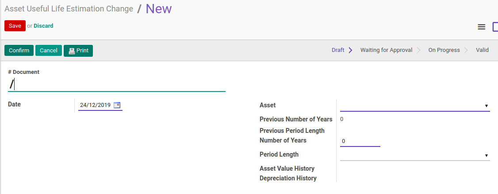
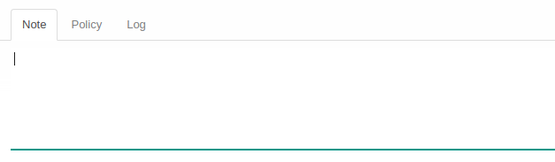
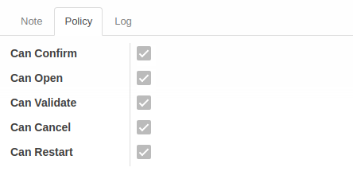
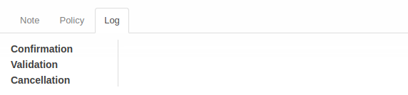

# Penjelasan Asset Useful Life Estimation Change

Informasi pada **Asset Useful Life Estimation Change** dibagi menjadi beberapa area, diantaranya:
* [Header](#bagian-header)
* [Tab Note](#tab-note)
* [Tab Policy](#tab-policy)
* [Tab Log](#tab-log)

### <a name="bagian-header">HEADER</a>

#### <a name="field-document"># Document</a>

Nomor Dokumen.

#### <a name="field-date">Date</a>

Tanggal.

#### <a name="field-asset">Asset</a>

Fix Aset.

#### <a name="field-previous-number-of-years">Previous Number of Years</a>

Jumlah tahun sebelumnya.

#### <a name="field-previous-periode-length">Previous Period Length</a>

Lama Periode Sebelumnya

#### <a name="field-number-of-years">Number of Years</a>

Jumlah tahun

#### <a name="field-periode-length">Period Length</a>

Lama Periode

#### <a name="field-asset-value-history">Asset Value History</a>

Histori nilai aset

#### <a name="field-depreciation-history">Depreciation History</a>

Histori depresiasi

### <a name="tab-note">TAB NOTE</a>

#### <a name="field-note">Note</a>

Catatan tambahan.

### <a name="tab-policy">TAB POLICY</a>

#### <a name="field-change-can-confirm">Can Confirm</a>

Diisi otomatis oleh Odoo. Jika aktif, maka user yang membuka data transisi dapat melakukan [mengkonfirmasi transisi](./mengkonfirmasi.md).

#### <a name="field-change-can-open">Can Open</a>

Diisi otomatis oleh Odoo. Jika aktif, maka user yang membuka data transisi dapat melakukan [proses menyetujui transisi](./menyetujui.md).
#TODO

#### <a name="field-change-can-validate">Can Validate</a>

Disii otomatis oleh Odoo. Jika aktif, maka user yang membuka data dapat [memvalidasi transisi](./memvalidasi.md).

#### <a name="field-change-can-cancel">Can Cancel</a>

Diisi otomatis oleh Odoo. Jika aktif, maka user yang membuka data dapat [membatalkan transisi](./membatalkan.md).

#### <a name="field-change-can-restart">Can Restart</a>

Diisi otomatis oleh Odoo. Jika aktif, maka user yang membuka data dapat [merestart transisi](./merestart.md).

### <a name="tab-log">TAB LOG</a>

#### <a name="field-log-confirmation">Confirmation</a>

Diisi otomatis oleh Odoo. Tanggal, waktu dan user yang [mengkonfirmasi transisi](./mengkonfirmasi.md).

#### <a name="field-log-validation">Validation</a>

Diisi otomatis oleh Odoo. Tanggal, waktu, dan user yang [memvalidasi transisi](./memvalidasi.md).

#### <a name="field-log-cancellation">Cancellation</a>

Diisi otomatis oleh Odoo. Tanggal, waktu, dan user yang [membatalkan transisi](./membatalkan.md).

[**Kembali ke menu Asset Useful Life Estimation Change**](./../asset-useful-life-estimation-change.md)
