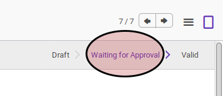

# Membatalkan Complex Asset Installation

## A. INPUT

* Data complex asset installation yang dibatalkan harus memiliki status **Draft** atau **Waiting for Approval**.

* User yang akan membatalkan harus memiliki akses untuk membatalkan complex asset installation.

## B. LANGKAH KERJA

1. Buka menu **Accounting -> Assets -> Complex Asset -> Installation**. Abaikan jika sudah berada pada menu yang dimaksud.
2. Buka data complex asset installation yang akan dibatalkan. Abaikan jika data sudah dibuka.
3. Klik tombol **Confirm** pada bagian atas-kiri form.

## C. OUTPUT

* Status complex asset installation akan berubah menjadi **Cancel**.

## D. KEMBALI KE MENU SEBELUMNYA

[**Kembali ke menu Complex Asset Installation**](./../complex-asset-installation.md)
