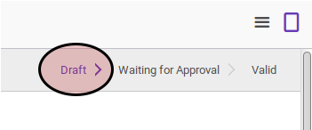

# Memodifikasi Complex Asset Installation

## A. INPUT

* Data complex asset installation yang dimodifikasi harus memiliki status **Draft**

## B. LANGKAH KERJA

1. Buka menu **Accounting -> Assets -> Complex Asset -> Installation**. Abaikan jika sudah berada pada menu yang dimaksud.
2. Buka data complex asset installation yang akan dimodifikasi. Abaikan jika data sudah dibuka.
3. Klik tombol **Edit** pada bagian atas-kiri form.

4. Isi dan sesuaikan **# Document** jika dibutuhkan. Harus diisi.
5. Isi dan sesuaikan **Date** jika dibutuhkan. Harus diisi.
6. Pilih dan sesuaikan **Asset** jika dibutuhkan. Harus diisi.
7. Pilih dan sesuaikan **Install Asset On** jika dibutuhkan. Harus diisi.
8. Buka tab **Note**.
9. Isi dan sesuaikan **Note** jika dibutuhkan. Tidak harus diisi.
10. Klik tombol **Save** pada bagian atas-kiri form.

## C. OUTPUT

* Data complex asset installation akan berubah sesuai dengan perubahan yang dilakukan.

## D. KEMBALI KE MENU SEBELUMNYA

[**Kembali ke menu Complex Asset Installation**](./../complex-asset-installation.md)
