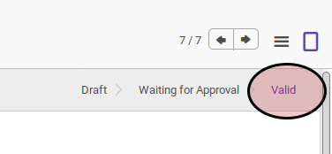

# Memvalidasi Complex Asset Installation

## A. INPUT

* Data complex asset installation yang divalidasi harus memiliki status **Waiting for Approval**

* User yang akan memvalidasi harus memiliki akses untuk memvalidasi complex asset installation.

## B. LANGKAH KERJA

1. Buka menu **Accounting -> Assets -> Complex Asset -> Installation**. Abaikan jika sudah berada pada menu yang dimaksud.
2. Buka data complex asset installation yang akan divalidasi. Abaikan jika data sudah dibuka.
3. Klik tombol **Valid** pada bagian atas-kiri form.

## C. OUTPUT

* Status complex asset installation akan berubah menjadi **Valid**.

