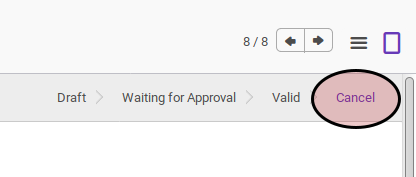
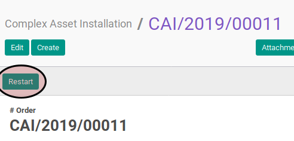

# Merestart Complex Asset Installation

## A. INPUT

* Data complex asset installation yang direstart harus memiliki status **Cancel**

* User yang akan merestart harus memiliki akses untuk merestart complex asset installation.

## B. LANGKAH KERJA

1. Buka menu **Accounting -> Assets -> Complex Asset -> Installation**. Abaikan jika sudah berada pada menu yang dimaksud.
2. Buka data complex asset installation yang akan direstart. Abaikan jika data sudah dibuka.
3. Klik tombol **Restart** pada bagian atas-kiri form.

## C. OUTPUT

* Status complex asset installation akan berubah menjadi **Draft**.

