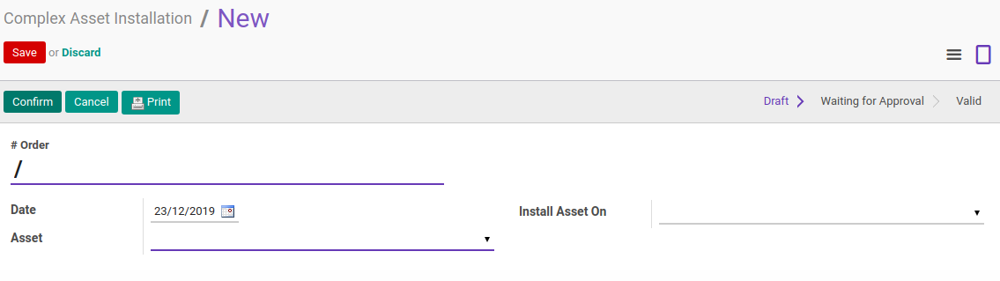
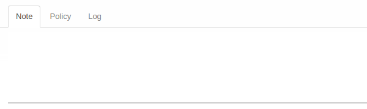
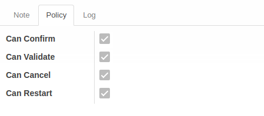
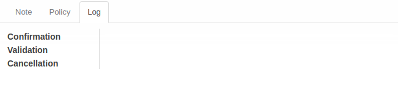

# Penjelasan Complex Asset Installation

Informasi pada **Complex Asset Installation** dibagi menjadi beberapa area, diantaranya:
* [Header](#bagian-header)
* [Tab Note](#tab-note)
* [Tab Policy](#tab-policy)
* [Tab Log](#tab-log)

### <a name="bagian-header">HEADER</a>

#### <a name="field-order"># No Order</a>

Nomor Order.
(Nomor akan terisi otomatis setelah dikonfirmasi)

#### <a name="field-date">Date</a>

Tanggal Instalasi Aset.

#### <a name="field-install-asset-on"># Install Asset On</a>

Pilih dimana aset ini akan dipasang/diinstall
(List aset merupakan daftar aset dengan type view).

#### <a name="field-aset">Aset</a>

Pilih Aset yang akan dipasang.
(List aset merupakan daftar fixed asset)

### <a name="tab-note">TAB NOTE</a>

#### <a name="field-note">Note</a>

Catatan tambahan.

### <a name="tab-policy">TAB POLICY</a>

#### <a name="field-change-can-confirm">Can Confirm</a>

Diisi otomatis oleh Odoo. Jika aktif, maka user yang membuka data transisi dapat melakukan [mengkonfirmasi transisi](./mengkonfirmasi.md).

#### <a name="field-change-can-validate">Can Validate</a>

Disii otomatis oleh Odoo. Jika aktif, maka user yang membuka data dapat [memvalidasi transisi](./memvalidasi.md).

#### <a name="field-change-can-cancel">Can Cancel</a>

Diisi otomatis oleh Odoo. Jika aktif, maka user yang membuka data dapat [membatalkan transisi](./membatalkan.md).

#### <a name="field-change-can-restart">Can Restart</a>

Diisi otomatis oleh Odoo. Jika aktif, maka user yang membuka data dapat [merestart transisi](./merestart.md).

### <a name="tab-log">TAB LOG</a>

#### <a name="field-log-confirmation">Confirmation</a>

Diisi otomatis oleh Odoo. Tanggal, waktu dan user yang [mengkonfirmasi transisi](./mengkonfirmasi.md).

#### <a name="field-log-validation">Validation</a>

Diisi otomatis oleh Odoo. Tanggal, waktu, dan user yang [memvalidasi transisi](./memvalidasi.md).

#### <a name="field-log-cancellation">Cancellation</a>

Diisi otomatis oleh Odoo. Tanggal, waktu, dan user yang [membatalkan transisi](./membatalkan.md).

[**Kembali ke menu Complex Asset Installation**](./../complex-asset-installation.md)
