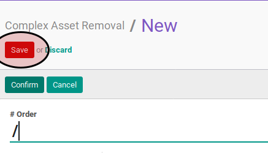

# Membuat Complex Asset Removal

## A. INPUT

*(Tidak ada instruksi khusus)*

## B. LANGKAH KERJA

1. Buka menu **Accounting -> Assets -> Complex Asset -> Removal**. Abaikan jika sudah berada pada menu yang dimaksud.
2. Klik tombol **Create** pada bagian atas-kiri form.

3. Isi dan sesuaikan **# Document** jika dibutuhkan. Harus diisi.
4. Isi **Date**. Harus diisi.
5. Pilih **Asset**. Harus diisi.
6. Buka tab **Note**.
7. Isi **Note**. Tidak harus diisi.
8. Klik tombol **Save** pada bagian atas-kiri form.

## C. OUTPUT

* Data complex asset removal akan terbuat dengan status **Draft**.

