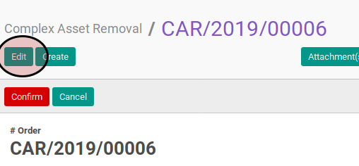
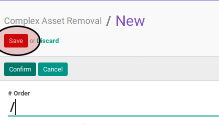

# Memodifikasi Complex Asset Removal

## A. INPUT

* Data complex asset removal yang dimodifikasi harus memiliki status **Draft**

## B. LANGKAH KERJA

1. Buka menu **Accounting -> Assets -> Complex Asset -> Removal**. Abaikan jika sudah berada pada menu yang dimaksud.
2. Buka data complex asset removal yang akan dimodifikasi. Abaikan jika data sudah dibuka.
3. Klik tombol **Edit** pada bagian atas-kiri form.

4. Isi dan sesuaikan **# Document** jika dibutuhkan. Harus diisi.
5. Isi dan sesuaikan **Date** jika dibutuhkan. Harus diisi.
6. Pilih dan sesuaikan **Asset** jika dibutuhkan. Harus diisi.
7. Buka tab **Note**.
8. Isi dan sesuaikan **Note** jika dibutuhkan. Tidak harus diisi.
9. Klik tombol **Save** pada bagian atas-kiri form.

## C. OUTPUT

* Data complex asset removal akan berubah sesuai dengan perubahan yang dilakukan.

## D. KEMBALI KE MENU SEBELUMNYA

[**Kembali ke menu Complex Asset Removal**](./../complex-asset-removal.md)
