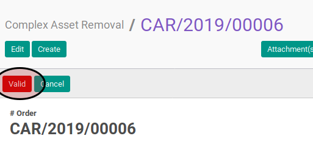
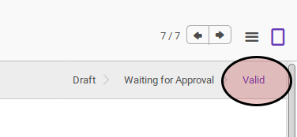

# Memvalidasi Complex Asset Removal

## A. INPUT

* Data complex asset removal yang divalidasi harus memiliki status **Waiting for Approval**

* User yang akan memvalidasi harus memiliki akses untuk memvalidasi complex asset removal.

## B. LANGKAH KERJA

1. Buka menu **Accounting -> Assets -> Complex Asset -> Removal**. Abaikan jika sudah berada pada menu yang dimaksud.
2. Buka data complex asset removal yang akan divalidasi. Abaikan jika data sudah dibuka.
3. Klik tombol **Valid** pada bagian atas-kiri form.

## C. OUTPUT

* Status complex asset removal akan berubah menjadi **Valid**.

## D. KEMBALI KE MENU SEBELUMNYA

[**Kembali ke menu Complex Asset Removal**](./../complex-asset-removal.md)
