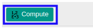

# Membuat Tabel Depresiasi

## A. INPUT

* Data fixed asset yang akan dibuat tabel depresiasi harus memiliki status **Draft**.

* User yang akan membuat tabel depresiasi harus memiliki akses untuk membuat tabel depresiasi fixed asset.

## B. LANGKAH KERJA

1. Buka menu **Accounting -> Assets -> Assets**. Abaikan jika sudah berada pada menu yang dimaksud.
2. Buka data fixed asset yang akan dibuat tabel depresiasi. Abaikan jika data sudah dibuka.
3. Beralih ke tab **[Depreciation Board](./penjelasan.md#tab-depreciation)**.
4. Klik tombol *Compute* pada bagian kiri-atas tabel depresiasi.

## C. OUTPUT

* Tabel depresiasi fixed asset telah terbuat.
