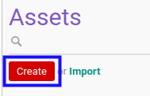
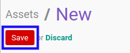

# Membuat Fixed Asset

## A. INPUT

*(Tidak ada instruksi khusus)*

## B. LANGKAH KERJA

1. Buka menu **Accounting -> Assets -> Assets**. Abaikan jika sudah berada pada menu yang dimaksud.
2. Klik tombol **Create** pada bagian atas-kiri form.

3. Ubah **[# Asset](./penjelasan.md#field-name)** dengan penomeran yang dikehendaki. Biarkan berisi **/**
apabila menghendaki penomeran otomatis. Wajib diisi.
4. Isi **[Name of Asset](./penjelasan.md#field-name)**. Wajib diisi.
5. Pilih **[Parent Asset](./penjelasan.md#field-parent-asset)**. Wajib diisi.
6. Pilih **[Type](./penjelasan.md#field-type)**. Wajib diisi.
7. Beralih ke tab **[General](./penjelasan.md#tab-general)**.
8. Isi **[Purchase Value](./penjelasan.md#field-purchase-value)**. Wajib diisi.
9. Pilih **[Start Date](./penjelasan.md#field-start-date)**. Wajib diisi.
10. Isi **[Salvage Value](./penjelasan.md#field-salvage-value)**. Tidak wajib diisi.
11. Pilih **[Asset Category](./penjelasan.md#field-asset-category)**. Wajib diisi.
12. Pilih **[Analytic Account](./penjelasan.md#field-analytic-account)**. Tidak wajib diisi.
13. Pilih **[Partner](./penjelasan.md#field-partner)**. Tidak wajib diisi.
14. Pilih **[Time Method](./penjelasan.md#field-time-method)**. Wajib diisi.
15. Isi **[Number of Years](./penjelasan.md#no-of-years)**. Wajib diisi.
16. Pilih **[Period Length](./penjelasan.md#field-period-length)**. Wajib diisi.
17. Pilih **[Computation Method](./penjelasan.md#field-computation-method)**. Wajib diisi.
18. Aktifkan/ Deaktifkan **[Prorata Temporis](./penjelasan.md#field-prorata-temporis)**. Tidak wajib diisi.
19. Aktifkan/ Deaktifkan **[Prorate by Month](./penjelasan.md#field-prorate-by-month)**. Tidak wajib diisi.
20. Isi **[Date Min. to Prorate](./penjelasan.md#field-date-min)**. Tidak wajib diisi.
21. Klik tombol **Save** pada bagian atas-kiri form.

## C. OUTPUT

* Data fixed asset akan terbuat dengan status **Draft**

