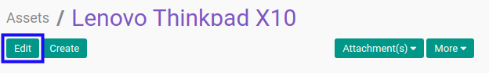
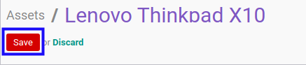

# Memodifikasi Fixed Asset

## A. INPUT

* Data fixed asset yang dapat dimodifikasi harus memiliki status **Draft**.
* User yang akan memodifikasi harus memiliki akses untuk memodifikasi fixed asset.

## B. LANGKAH KERJA

1. Buka menu **Accounting -> Assets -> Assets**. Abaikan jika sudah berada pada menu yang dimaksud.
2. Buka data fixed asset yang akan dimodifikasi. Abaikan jika data sudah dibuka.
3. Klik tombol **Edit** pada bagian atas-kiri form.

4. Ubah **[Code of Asset](./penjelasan.md#field-name)** jika dibutuhkan. Wajib diisi.
5. Ubah **[Name of Asset](./penjelasan.md#field-name)** jika dibutuhkan. Wajib diisi.
6. Isi dan sesuaikan **[Name of Asset](./penjelasan.md#field-name)** jika dibutuhkan. Wajib diisi.
7. Pilih dan sesuaikan **[Parent Asset](./penjelasan.md#field-parent-asset)** jika dibutuhkan. Wajib diisi.
8. Pilih dan sesuaikan **[Type](./penjelasan.md#field-type)** jika dibutuhkan. Wajib diisi.
9. Beralih ke tab **[General](./penjelasan.md#tab-general)**.
10. Isi dan sesuaikan **[Purchase Value](./penjelasan.md#field-purchase-value)** jika dibutuhkan. Wajib diisi.
11. Pilih dan sesuaikan **[Start Date](./penjelasan.md#field-start-date)** jika dibutuhkan. Wajib diisi.
12. Isi dan sesuaikan **[Salvage Value](./penjelasan.md#field-salvage-value)** jika dibutuhkan. Tidak wajib diisi.
13. Pilih dan sesuaikan **[Asset Category](./penjelasan.md#field-asset-category)** jika dibutuhkan. Wajib diisi.
14. Pilih dan sesuaikan **[Analytic Account](./penjelasan.md#field-analytic-account)** jika dibutuhkan. Tidak wajib diisi.
15. Pilih dan sesuaikan **[Partner](./penjelasan.md#field-partner)** jika dibutuhkan. Tidak wajib diisi.
16. Pilih dan sesuaikan **[Time Method](./penjelasan.md#field-time-method)** jika dibutuhkan. Wajib diisi.
17. Isi dan sesuaikan **[Number of Years](./penjelasan.md#no-of-years)** jika dibutuhkan. Wajib diisi.
18. Pilih dan sesuaikan **[Period Length](./penjelasan.md#field-period-length)** jika dibutuhkan. Wajib diisi.
19. Pilih dan sesuaikan **[Computation Method](./penjelasan.md#field-computation-method)** jika dibutuhkan. Wajib diisi.
20. Aktifkan/ Deaktifkan **[Prorata Temporis](./penjelasan.md#field-prorata-temporis)** jika dibutuhkan. Tidak wajib diisi.
21. Aktifkan/ Deaktifkan **[Prorate by Month](./penjelasan.md#field-prorate-by-month)** jika dibutuhkan. Tidak wajib diisi.
22. Isi dan sesuaikan **[Date Min. to Prorate](./penjelasan.md#field-date-min)** jika dibutuhkan. Tidak wajib diisi.
23. Klik tombol **Save** pada bagian atas-kiri form.

## C. OUTPUT

* Data fixed asset akan berubah sesuai dengan perubahan yang dilakukan.
