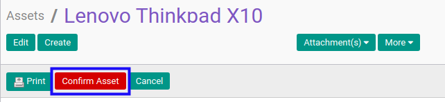

# Mengkonfirmasi Fixed Asset

## A. INPUT

* Data fixed asset yang akan dikonfirmasi harus memiliki status **Draft**.

* User yang akan mengkonfirmasi harus memiliki akses untuk mengkonfirmasi fixed asset.

## B. LANGKAH KERJA

1. Buka menu **Accounting -> Assets -> Assets**. Abaikan jika sudah berada pada menu yang dimaksud.
2. Buka data fixed asset yang akan dikonfirmasi. Abaikan jika data sudah dibuka.
3. Klik tombol **Confirm** pada bagian atas-kiri form.

## C. OUTPUT

* Status dari fixed asset akan berubah menjadi **Waiting for Approval**.

* Isian fixed asset sudah tidak bisa diubah.
