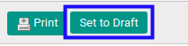
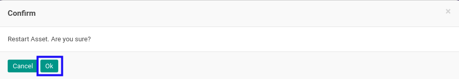

# Merestart Fixed Asset

## A. INPUT

* Data fixed asset yang akan direstart harus memiliki status **Cancelled**.

* User yang akan merestart harus memiliki akses untuk merestart fixed asset.

## B. LANGKAH KERJA

1. Buka menu **Accounting -> Assets -> Assets**. Abaikan jika sudah berada pada menu yang dimaksud.
2. Buka data fixed asset yang akan direstart. Abaikan jika data sudah dibuka.
3. Klik tombol **Set to Draft** pada bagian atas-kiri form.

4. Klik tombol **Ok** pada *pop-up* konfirmasi restart yang muncul.

## C. OUTPUT

* Status dari fixed asset akan berubah menjadi **Draft**.

* Fixed asset dapat kembali dimodifikasi.
