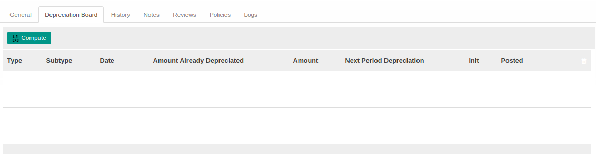

# Penjelasan Fixed Asset

Informasi pada *Fixed Asset* dibagi menjadi beberapa area, diantaranya:

* [Header](#bagian-header)
* [Tab General](#tab-general)
* [Tab Depreciation Board](#tab-depreciation)
* [Tab History](#tab-history)
* [Tab Notes](#tab-notes)
* [Tab Reviews](#tab-reviews)
* [Tab Policy](#tab-policy)
* [Tab Log](#tab-log)

### <a name="bagian-header">HEADER</a>

#### <a name="field-name">Asset Name</a>

Nama Aset.

#### <a name="field-parent-asset">Parent Asset</a>

Hirarki induk aset yang dimaksud.

#### <a name="field-type">Type</a>

Tipe akun aset.

#### <a name="field-company">Company</a>

Nama perusahaan.

#### <a name="field-asset-value">Asset Value</a>

Nilai aset.

#### <a name="field-depreciated-value">Depreciated Value</a>

Nilai depresiasi aset.

#### <a name="field-residual-value-value">Residual Value</a>

Nilai sisa aset.

### <a name="tab-general">TAB GENERAL</a>

#### <a name="field-purchase-value">Purchase Value</a>

Nilai pembelian aset.

#### <a name="field-asset-start-date">Asset Start Date</a>

Tanggal awal aset.

#### <a name="field-salvage-value">Salvage Value</a>

Nilai buku aset.

#### <a name="field-asset-removal-date">Asset Removal Date</a>

Tanggal pemindahan aset.

#### <a name="field-asset-category">Asset Category</a>

Kategori aset.

#### <a name="field-analytic-account">Analytic Account</a>

Kode biaya.

#### <a name="field-partner">Partner</a>

Penyedia aset.

#### <a name="field-time-method">Time Method</a>

Metode perhitungan depresiasi aset.

#### <a name="field-no-of-years">Number of Years</a>

Jumlah tahun depresiasi aset.

#### <a name="field-period-length">Period Length</a>

Durasi waktu antar depresiasi aset.

#### <a name="field-age">Age Based On Period Length</a>

Jumlah waktu berdasarkan lama periode.

#### <a name="field-computation-method">Computation Method</a>

Metode komputasi depresiasi aset.

#### <a name="field-prorata-temporis">Prorata Temporis</a>

Jika diaktifkan, entri depresiasi awal akan dihitung dari awal pembelian aset.

#### <a name="field-prorate-by-month">Prorate by Month</a>

*to do*

#### <a name="field-date-min">Date Min. to Prorate</a>

*to do*

### <a name="tab-depreciation">TAB DEPRECIATION BOARD</a>

Hasil perhitungan depresiasi berdasarkan isian pada **[Tab General](./penjelasan.md#tab-general)**.

### <a name="tab-history">TAB HISTORY</a>

Hasil entri accounting berdasarkan posting line depresiasi pada **[Tab Depreciation Board](./penjelasan.md#tab-depreciation)**.

### <a name="tab-notes">TAB NOTES</a>

Catatan tambahan.

### <a name="tab-reviews">TAB REVIEWS</a>

#### <a name="field-definition">Definition</a>

Definisi review yang digunakan.

#### <a name="field-review-partners-validations">Review Partners Validations</a>

Daftar partner yang melakukan validasi.

### <a name="tab-policy">TAB POLICY</a>

#### <a name="field-can-confirm">Can Confirm</a>

Kebijakan untuk dapat melakukan konfirmasi.

#### <a name="field-can-close">Can Close</a>

Kebijakan untuk dapat melakukan closing.

#### <a name="field-can-cancel">Can Cancel</a>

Kebijakan untuk dapat melakukan pembatalan.

#### <a name="field-can-restart">Can Restart</a>

Kebijakan untuk dapat melakukan restart.

#### <a name="field-can-restart-approval">Can Restart Approval</a>

Kebijakan untuk dapat melakukan restart approval.

### <a name="tab-log">TAB LOG</a>

#### <a name="field-confirmation">Confirmation</a>

Log aktifitas User yang melakukan konfirmasi.

#### <a name="field-running-on">Running On</a>

Log aktifitas aset mulai dijalankan.

#### <a name="field-closing-on">Closing On</a>

Log aktifitas aset closing.

#### <a name="field-cancel">Cancel</a>

Log aktifitas User yang melakukan pembatalan.
